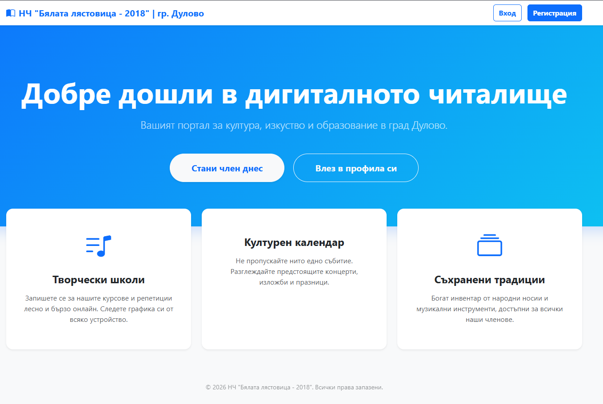
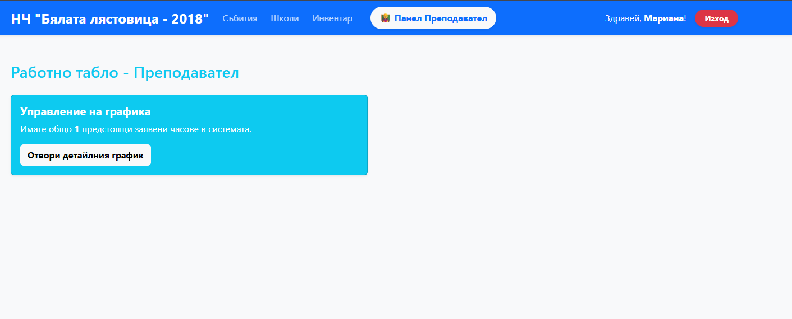

# 🏛️ Digital Chitalishte (Community Center Management System)


A comprehensive web-based ERP system designed to manage the daily operations of modern cultural institutions – from booking rehearsal slots and managing inventory, to financial tracking and attendance monitoring.

## 📖 Why I built this project?
This project was born out of a real-world necessity. Managing the activities of the "White Swallow - 2018" Community Center in the city of Dulovo, I face administrative challenges daily—juggling rehearsal schedules, manually collecting fees, tracking traditional inventory (folk costumes, instruments), and organizing the cultural calendar.

As a software developer, I decided to replace notebooks and spreadsheets with a functional, modern, and automated solution that digitizes these processes and simplifies the workflow for both the administration and the community members.

---

## ✨ Key Features & User Roles

The system is built with strict Role-Based Access Control (RBAC) and offers a tailored dashboard experience based on the user's role.

### 👤 1. Unregistered Visitor (Guest)
* Explores the modern landing page of the institution.
* Views upcoming events from the cultural calendar.
* Browses active courses, creative schools, and activities.

### 🎓 2. Registered User
* **Booking:** Enrolls in specific classes and rehearsals with a single click.
* **Personal Dashboard:** Tracks upcoming personal schedules.
* **Flexibility:** Can unenroll to free up capacity for others if unable to attend.

### 👨‍🏫 3. Instructor (Employee)
* **Schedule Management:** Creates lesson slots for their assigned courses, defining date, time, and maximum group capacity.
* **Digital Register:** Marks student attendance dynamically.
* **Financial Tracking:** Toggles payment statuses (Paid/Unpaid) for each attendee with instant visual feedback.

### ⚙️ 4. Administrator (Admin)
* *Note: To simplify the initial setup, **the first registered user in the system automatically receives the ADMIN role**.*
* **Control Center:** Manages users and assigns roles (e.g., promoting users to instructors).
* **Events & Courses:** Curates the institution's portfolio of activities.
* **Inventory Management:** Tracks traditional costumes, instruments, and props. Lends items to users and manages returns.
* **Financial Module:** Accesses a global real-time financial report showing collected revenue and pending payments, alongside a detailed transaction history.

---

## 📸 Screenshots

*Take a look inside the system:*

### Public Landing Page

*(Designed to attract new members and showcase activities)*

### Instructor Dashboard

*(Managing attendees, marking attendance, and tracking payments)*

### Admin Financial Report

*(Real-time aggregation of revenues and pending payments)*

---

## 🛠️ Tech Stack

**Backend:**
* Java
* Spring Boot
* Spring Data JPA (Hibernate)
* Spring Security

**Frontend:**
* Thymeleaf
* Bootstrap 5 & Bootstrap Icons
* HTML5 / CSS3

**Database:**
* MySQL

---

## 🚀 How to run locally

1. **Clone the repository:**
   ```bash
   git clone [https://github.com/your-username/chitalishte-management-system.git](https://github.com/your-username/chitalishte-management-system.git)
2. **Database Setup:**
   * Ensure you have a MySQL server running. 
   * Create an empty database. Example: 
   ```bash
   CREATE DATABASE chitalishte_db;
3. **Configuration (application.properties):**
   * Open _`src/main/resources/application.properties`_
   * Provide your database credentials:
   ```bash
    `spring.datasource.url=jdbc:mysql://localhost:3306/chitalishte_db?allowPublicKeyRetrieval=true&useSSL=false
     spring.datasource.username=root
     spring.datasource.password=your_password
     spring.jpa.hibernate.ddl-auto=update`
4. **Run the application:**
   * Open the project in your preferred IDE (IntelliJ IDEA / Eclipse). 
   * Run the main _`ChitalishteApplication.java class`_. 
   * Open your browser and navigate to _http://localhost:8080_.
5. **Getting Started:**
   * **Register your first account _(it will automatically become the Administrator)_.**
   * Create a course, register a second account, and promote them to an Instructor!

---

## 🔮 Бъдещо надграждане (Roadmap)
Този проект е солидна основа, която планирам да развивам. Предстоящи функционалности:

* [ ] **Payment Gateway** Integration (e.g., Stripe) for online fee payments.
* [ ] **Email Notifications** for class bookings, schedule changes, or upcoming events.
* [ ] **PDF Report Generation** for financial logs and attendance registers.
* [ ] **Donation Module** to support the community center's initiatives.Модул за дарения**, който да подпомага дейността на читалището.