# 🏛️ Digital Chitalishte (Community Center Management System)


A comprehensive web-based ERP system designed to manage the daily operations of modern cultural institutions – from booking rehearsal slots and managing inventory, to hall rentals, financial tracking, and attendance monitoring.

The system consists of **two independent Spring Boot applications** that communicate over REST: the main application (Thymeleaf server-rendered UI) and a separate **Hall & Equipment Rental microservice**, each with its own database.

## 📖 Why I built this project?
This project was born out of a real-world necessity. Managing the activities of the "White Swallow - 2018" Community Center in the city of Dulovo, I face administrative challenges daily—juggling rehearsal schedules, manually collecting fees, tracking traditional inventory (folk costumes, instruments), organizing the cultural calendar, and coordinating external hall rentals.

As a software developer, I decided to replace notebooks and spreadsheets with a functional, modern, and automated solution that digitizes these processes and simplifies the workflow for both the administration and the community members.

---

## 🏗️ Architecture

| Application | Role | Port | Database |
|---|---|---|---|
| `chitalishte-management-system` | Main app – Thymeleaf UI, Spring Security, courses/events/inventory management | `8080` | `chitalishte_management_system` |
| `rental-service` | REST microservice – hall & equipment rental, consumed by the main app via **Feign Client** | `8081` | `chitalishte_rental_db` |

When an administrator manages hall rentals from the main application, requests are forwarded over HTTP (via OpenFeign) to the `rental-service`, which owns and persists the rental data in its own database — a genuine service boundary rather than a shared database.

---

## ✨ Key Features & User Roles

The system is built with strict Role-Based Access Control (RBAC) via **Spring Security** (hashed passwords, CSRF-protected forms) and offers a tailored dashboard experience based on the user's role.

### 👤 1. Unregistered Visitor (Guest)
* Explores the modern landing page of the institution.
* Views upcoming events from the cultural calendar.
* Browses active courses, creative schools, and activities — including their group and/or individual pricing.

### 🎓 2. Registered User
* **Booking:** Enrolls in specific classes and rehearsals with a single click.
* **Personal Dashboard:** Tracks upcoming personal schedules.
* **Profile:** Views and edits their own profile information.
* **Flexibility:** Can unenroll to free up capacity for others if unable to attend.

### 👨‍🏫 3. Instructor (Employee)
* **Schedule Management:** Creates lesson slots for their assigned courses — group or individual format, each with its own capacity and pricing.
* **Digital Register:** Marks student attendance dynamically.
* **Financial Tracking:** Toggles payment statuses (Paid/Unpaid) for each attendee with instant visual feedback.

### ⚙️ 4. Administrator (Admin)
* *Note: To simplify the initial setup, **the first registered user in the system automatically receives the ADMIN role**.*
* **Control Center:** Manages users and assigns roles (e.g., promoting users to instructors).
* **Events & Courses:** Curates the institution's portfolio of activities.
* **Inventory Management:** Tracks traditional costumes, instruments, and props. Lends items to members and manages returns; overdue loans are flagged automatically.
* **Hall & Equipment Rentals:** Manages the list of rentable halls and equipment, and processes external rental requests (pending → confirmed/cancelled → completed) — all handled by the separate `rental-service` microservice through a real-time Feign integration.
* **Financial Module:** Accesses a global real-time financial report showing collected revenue and pending payments, alongside a detailed transaction history — combining both course-attendance fees and confirmed hall/equipment rental income (fetched live from `rental-service` via Feign).

---

## 🛠️ Tech Stack

**Backend:**
* Java 17, Spring Boot 4
* Spring MVC + Thymeleaf (main app), Spring RESTful API (microservice)
* Spring Data JPA (Hibernate)
* Spring Security (role-based auth, BCrypt password hashing, CSRF protection)
* Spring Cloud OpenFeign (inter-service communication)
* Spring Cache (in-memory caching for read-heavy listings)
* Spring Scheduling (`@Scheduled` cron + fixed-delay jobs)
* Spring AOP (cross-cutting execution-time logging advice)
* Spring Events (decoupled in-process notifications)

**Frontend:**
* Thymeleaf
* Bootstrap 5

**Database:**
* MySQL — one schema per application, each entity keyed by UUID

**Testing:**
* JUnit 5, Mockito, AssertJ, MockMvc, Spring Security Test, H2 (in-memory, test-only)
* JaCoCo coverage reporting (≥70% line coverage in both applications)

**DevOps:**
* Docker & Docker Compose (both applications + both MySQL databases)

---

## 🔗 Integrations Between Applications

* The main application's admin panel triggers **Feign Client** calls to the `rental-service` for hall and equipment CRUD and rental-request management (create, confirm/cancel status update, delete) — a real service-to-service integration, not a shared database.
* The `rental-service` runs a nightly **cron job** that automatically marks expired confirmed rentals as completed, and caches its read endpoints, evicting the cache on every write.
* The main application runs a separate **fixed-delay job** that periodically flags inventory items that have been borrowed for too long.

---

## 🚀 How to run locally

### Option A — Docker Compose (recommended, starts everything)

```bash
docker compose up --build
```

This starts both MySQL databases, the `rental-service` microservice, and the main application. The main app will be available at `http://localhost:8080` and the microservice at `http://localhost:8081`.

Optionally set a custom database password before starting:

```bash
DB_PASSWORD=your_password docker compose up --build
```

### Option B — Running manually

1. **Clone the repository:**
   ```bash
   git clone https://github.com/SvetDrag/chitalishte-management-system.git
   ```
2. **Start MySQL** and create two databases (or let `createDatabaseIfNotExist=true` create them automatically): `chitalishte_management_system` and `chitalishte_rental_db`.
3. **Provide database credentials** via environment variables (`DB_USERNAME`, `DB_PASSWORD`) or a local, git-ignored `application-local.properties` file in each application's `src/main/resources`.
4. **Run the microservice first:**
   ```bash
   cd rental-service
   ./mvnw spring-boot:run
   ```
5. **Run the main application** (in a separate terminal, from the repository root):
   ```bash
   ./mvnw spring-boot:run
   ```
6. Open your browser at `http://localhost:8080`.
7. **Getting Started:** Register your first account *(it automatically becomes the Administrator)*. Create a course, add a hall, register a second account, and promote them to an Instructor!

### 🌱 Loading demo data

Both applications ship an optional demo-data seeder, disabled by default (each app starts with an empty database). To load a ready-made dataset — demo accounts for every role, courses, events, inventory, halls, equipment, and rental requests — set `app.seed.enabled=true` in each app's `application-local.properties` and restart. Full contents (including the demo login credentials) are documented in [`SEED_DATA.txt`](SEED_DATA.txt).

> ⚠️ Enabling the seeder wipes any existing data in that database — use it only on a fresh local/demo database.

### Running the tests

```bash
./mvnw test              # main application
cd rental-service && ./mvnw test   # microservice
```

JaCoCo HTML coverage reports are generated at `target/site/jacoco/index.html` in each module.

---

## 📸 Screenshots

*Take a look inside the system:*

### Public Landing Page

*(Designed to attract new members and showcase activities)*

### Admin Dashboard
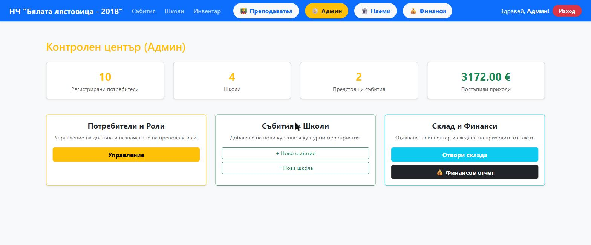
*(At-a-glance stats — users, courses, upcoming events, revenue — plus quick access to every admin area)*

### Public Homepage Preview
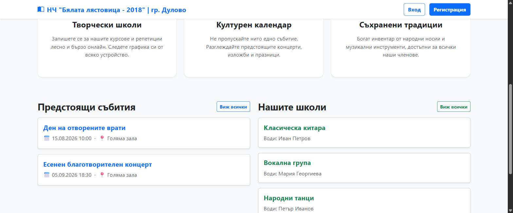
*(Guests see a live preview of upcoming events and active courses right on the landing page)*

### Admin Financial Report

*(Real-time aggregation of revenues and pending payments — including confirmed hall/equipment rental income)*

### Hall & Equipment Rentals (rental-service microservice)
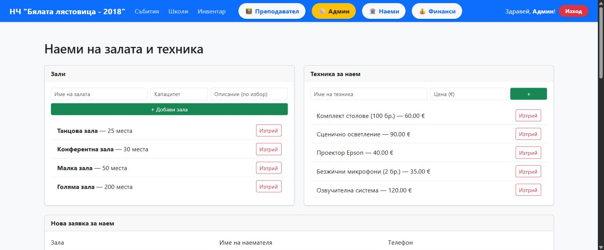
*(Managed through a real service-to-service Feign integration with the separate `rental-service` microservice)*

---

## 👨‍💻 About the Author

**Svetlozar Dragnev**  
*19-year-old innovative ICT student, aspiring software developer, and community leader.*

I combine a strong technical foundation in software logic with proven organizational and administrative skills. Skilled in Java, Windows OS, and troubleshooting, I am passionate about starting a career in the IT sector, building impactful solutions, and delivering excellent user experiences.

**Current Roles & Education:**
* 🎓 **BSc in Information and Communication Technologies** – Nikola Vaptsarov Naval Academy (NVNA), Varna
* 💻 **Software Engineering Student** – SoftUni (Since March 2025)
* 🏛️ **Chairman** – Community Center "Byalata lyastovica - 2018", Dulovo (Since Feb 2025)
* 👨‍🏫 **Instructor (Programming, Graphic Design & AI)** – Advance Academy, Varna (Since Nov 2025)
* 🎸 *Fun fact: I also studied guitar, blending my analytical mindset with creative pursuits!*

**Connect with me:**  
[](https://github.com/SvetDrag)

---

## 🔮 Roadmap
This project is a solid foundation that I plan to expand. Upcoming features include:

* [ ] **Payment Gateway** Integration (e.g., Stripe) for online fee payments.
* [ ] **Email Notifications** for class bookings, schedule changes, or upcoming events.
* [ ] **PDF Report Generation** for financial logs and attendance registers.
* [ ] **Donation Module** to support the community center's initiatives.

---
## 📸 More Screenshots

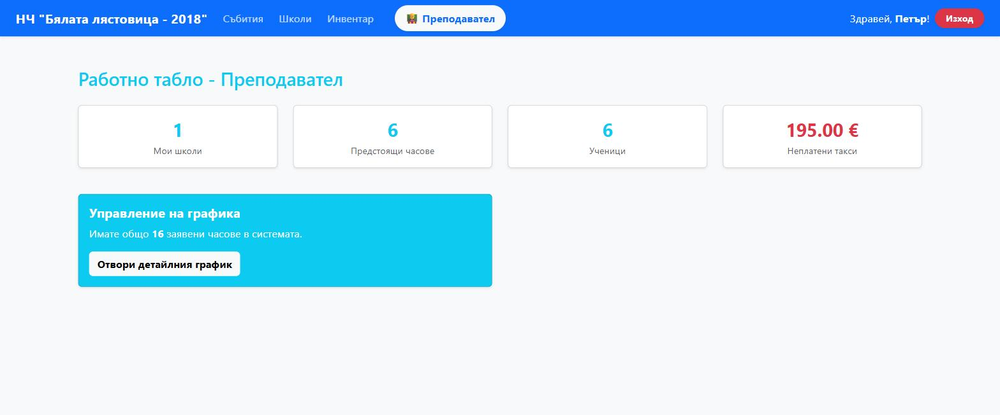

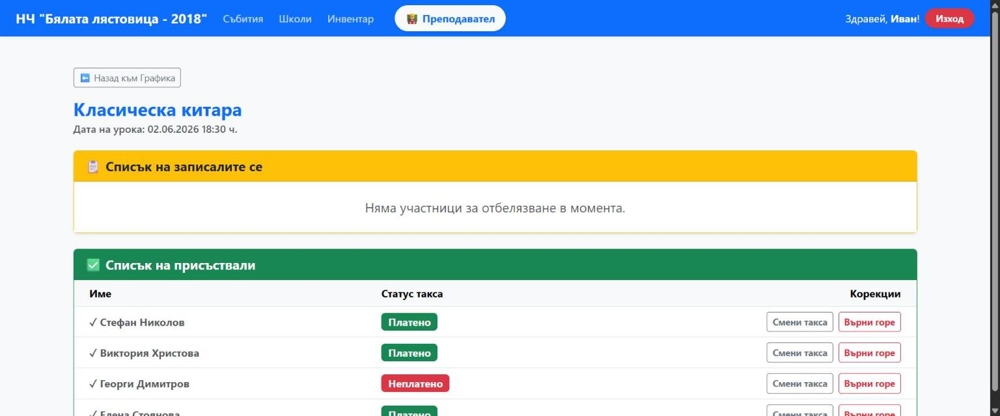

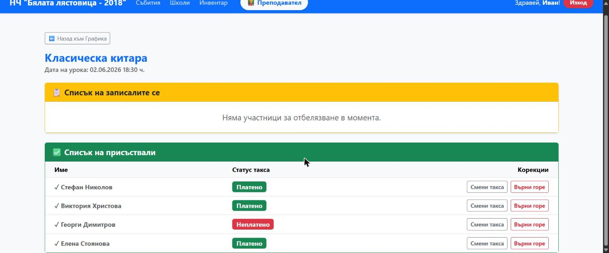

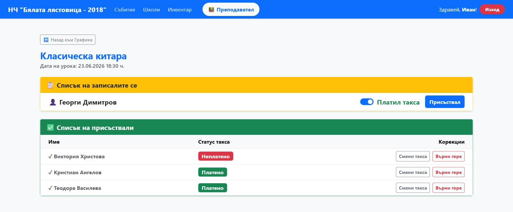

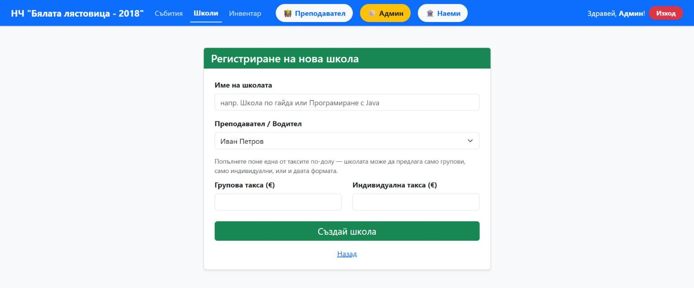

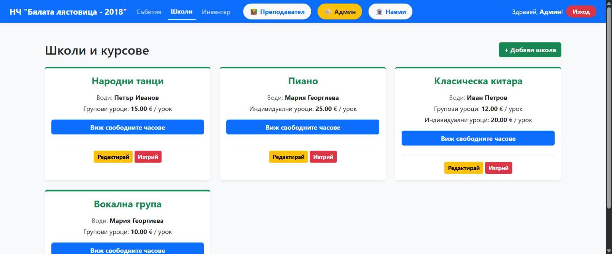

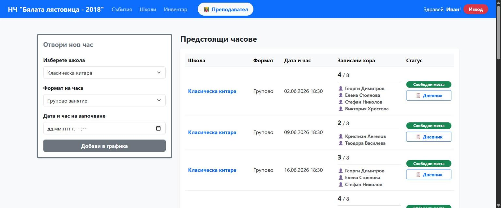

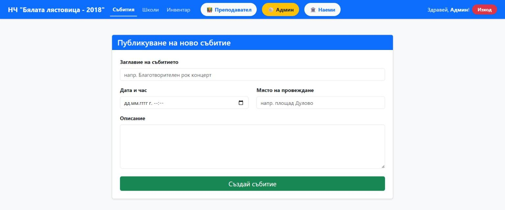

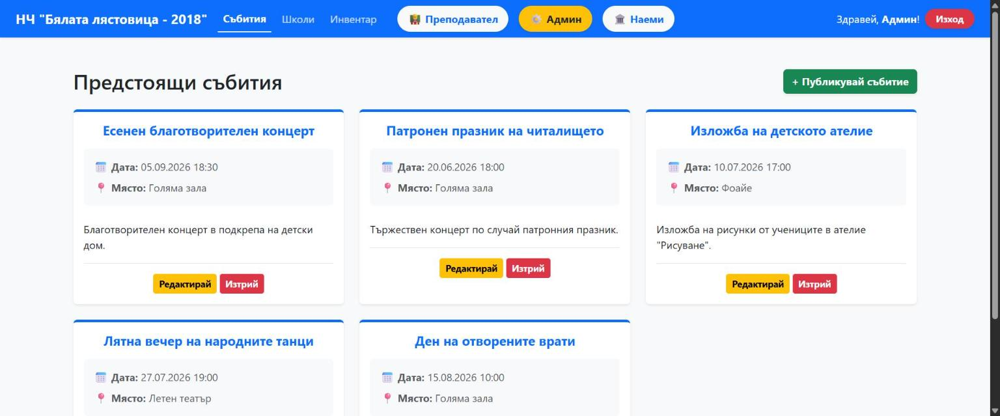

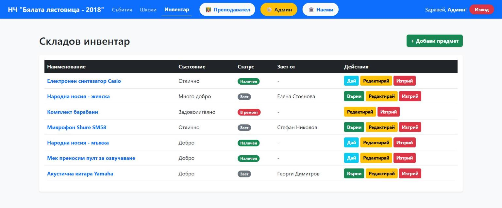

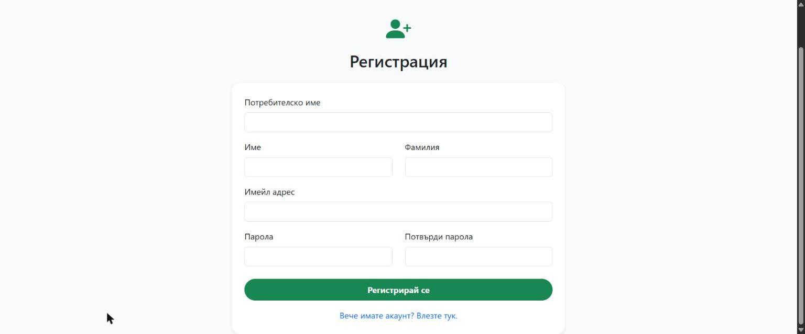

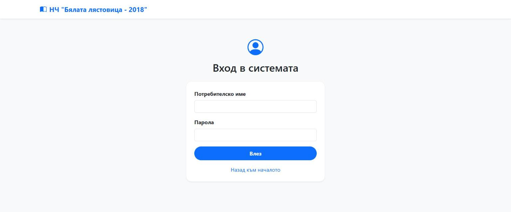

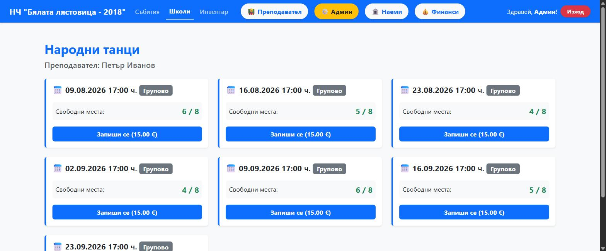

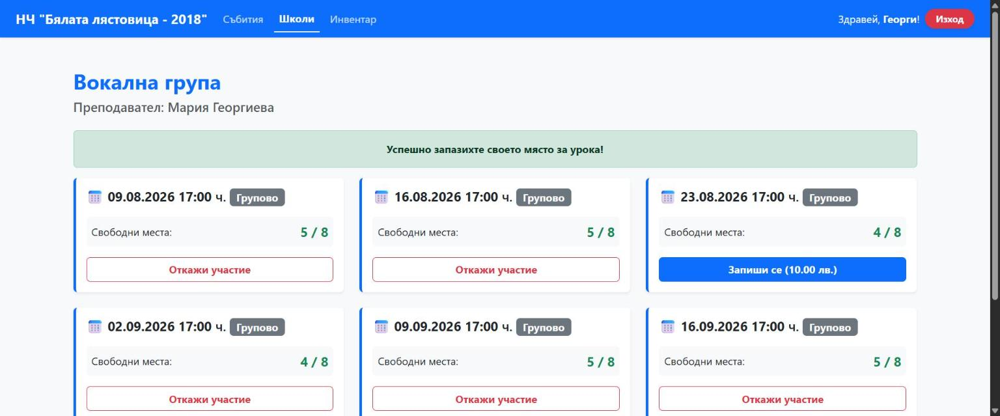

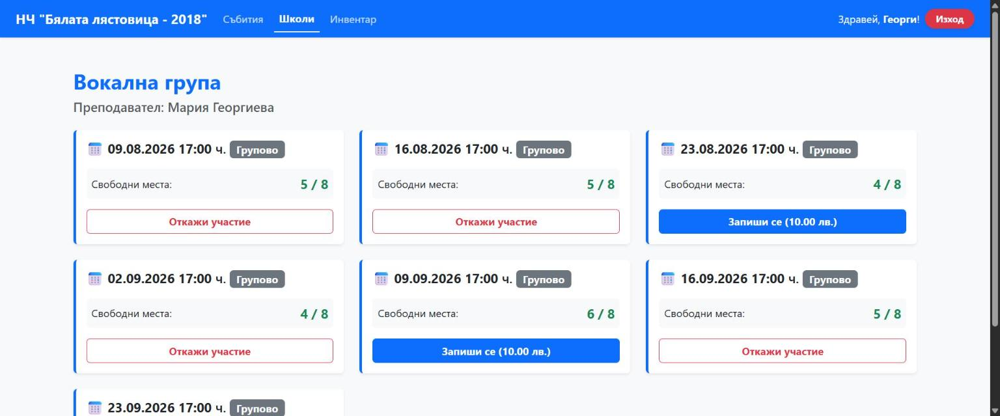

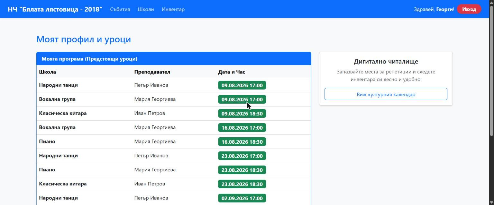

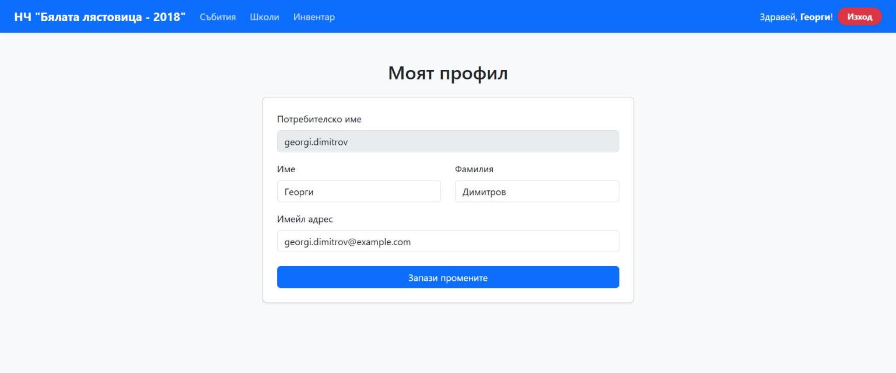

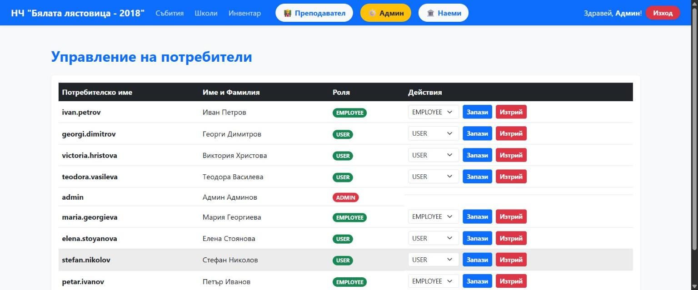


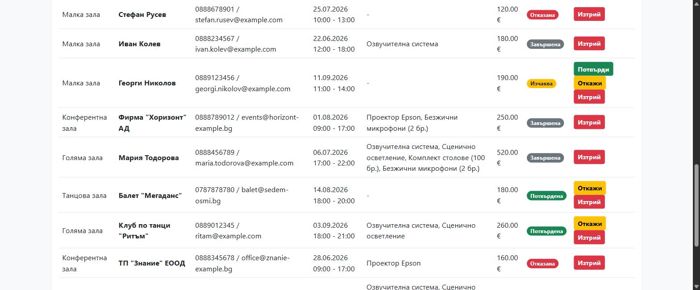
